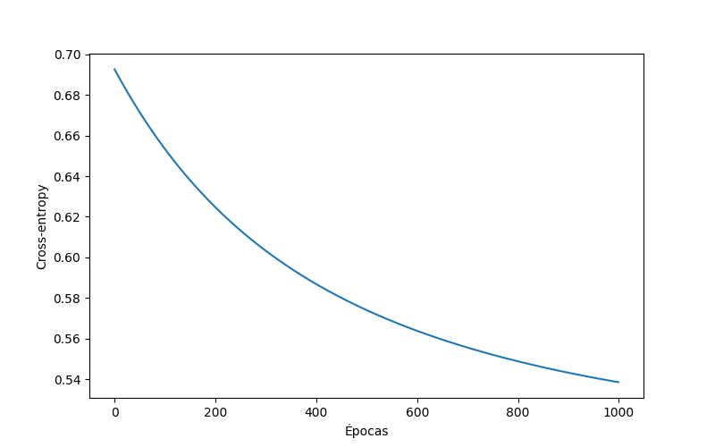
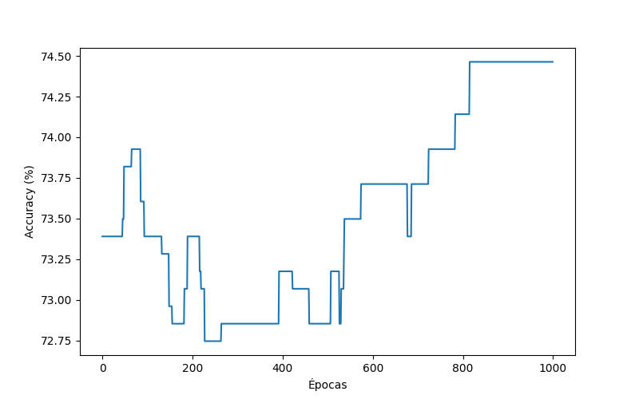

# Portafolio_Implementacion_TC3006C

Implementación manual de un algoritmo de aprendizaje automático sin el uso de frameworks o librerías de machine learning.

## Descripción del dataset

El dataset elegido contiene información clínica y demográfica de pacientes con el propósito de clasificar si una persona puede sufrir un accidente cerebrovascular. 
El dataset se encuentra organizado de la siguiente manera:

| Variable             | Descripción |
|----------------------|-------------|
| `id`                 | Identificador único del paciente |
| `gender`             | Género (Male / Female / Other) |
| `age`                | Edad del paciente |
| `hypertension`       | Hipertensión (0 = No, 1 = Sí) |
| `heart_disease`      | Enfermedad cardíaca (0 = No, 1 = Sí) |
| `ever_married`       | Estado civil (Yes / No) |
| `work_type`          | Tipo de trabajo (Children / Govt_job / Never_worked / Private / Self-employed) |
| `Residence_type`     | Tipo de residencia (Rural / Urban) |
| `avg_glucose_level`  | Nivel promedio de glucosa en sangre |
| `bmi`                | Índice de masa corporal (IMC) |
| `smoking_status`     | Tabaquismo (Formerly smoked / Never smoked / Smokes / Unknown) |
| `stroke`             | Variable objetivo (1 = tuvo un stroke, 0 = no tuvo stroke) |

Fuente: [Kaggle - Heart Stroke Dataset](https://www.kaggle.com/datasets/madhavtesting/heart-stroke-dataset)

## Objetivo

Teniendo lo anterior en mente utilizaré un modelo de clasificación logística, en este caso binario, donde mi "y" será stroke, lo que representa si tiene probabilidad de que sufra un accidente cerebrovascular y las "x" serán el resto de columnas de mi dataset, aunque no todas, puesto que más adelante por medio de ETL nos quedaremos con los datos más significativo.

## Procedimiento

### ETL y Preprocesamiento de Datos

1. **Carga de datos:**  
   Se leyó el archivo CSV original que contenía la información y se creó el dataframe.

2. **Análisis inicial:**  
   Se exploraron valores nulos y se observó que la variable **bmi** tenía 135 valores faltantes, mientras que **smoking_status** contenía una categoría **Unknown** que representaba información ausente.

3. **Imputación de valores faltantes:**  
   - **bmi:**  
     En lugar de reemplazar los valores faltantes con una media o mediana global, se optó por imputar la **mediana agrupada por género y grupo de edad**.  
     - El índice de masa corporal (IMC) varía significativamente según el sexo y la etapa de la vida.  
     - Por ejemplo, el IMC promedio de un hombre de 15 años no es comparable con el de una mujer de 70 años.  
     - Esta técnica permite imputar valores más representativos y reduce el sesgo en los datos.  

   - **smoking_status:**  
     Se mantuvo la categoría **Unknown** como clase adicional.  
     - Eliminar estos registros significaría perder información valiosa y reducir el tamaño del dataset.  
     - Agruparlos dentro de una categoría evita descartar datos y permite que el modelo aprenda con la mayor información posible.
     - Sin embargo, esto puede introducir ruido, ya que saber si fuma o no, podría llegar a ser un factor de mucha relevancia.

4. **Transformación de variables categóricas:**  
   - **Variables binarias:**  
     - **gender**: se transformó como 1 = Male y 0 = Female.  
     - **ever_married**: se transformó como 1 = Yes y 0 = No.  
    - **Variables categóricas:**  
        Como el modelo implementado es muy básico, era indispensable trabajar únicamente con valores numéricos.  
        Por eso, las variables en formato de texto se transformaron en números:  
        - **gender y ever_married** se representaron como variables binarias (0 y 1).  
        - **work_type, Residence_type y smoking_status** se dividieron en varias columnas de 0 y 1, cada una indicando si el paciente pertenecía o no a esa categoría.  
        Esto permitió que el modelo pudiera procesar la información correctamente sin perder la esencia de cada variable. 

5. **Normalización de variables numéricas:**  
   - Las variables **age, avg_glucose_level y bmi** fueron transformadas usando la fórmula de normalización Z-score:  

     Z = (X - media) / desviación estándar  

   - Estas variables están en diferentes escalas (ej. edad en años, glucosa en mg/dL, IMC en kg/m²).
   - Normalizarlas garantiza que ninguna domine el cálculo del gradiente descendente por tener valores numéricamente más grandes.

6. **Bias:**  
   Se agregó una columna de 1’s al inicio de la matriz de predictores para representar el sesgo (**bias**) de la regresión logística, permitiendo que la función hipótesis se ajuste de manera más flexible.

7. **Partición de datos:**  
   El dataset fue dividido en:  
   - **60% entrenamiento**: para ajustar los pesos del modelo.  
   - **20% validación**: para ajustar hiperparámetros y monitorear el rendimiento durante el entrenamiento.  
   - **20% prueba**: para evaluar la capacidad de generalización del modelo en datos nunca vistos.

---

### Implementación del Modelo
1. Se creó la clase **NeuronaLogistica** con las siguientes funciones:  
   - **Función hipótesis (sigmoide):** para mapear las entradas a probabilidades entre 0 y 1.  
   - **Función de costo (cross-entropy):** para medir el error del modelo en términos probabilísticos. Qué tan lejos están las predicciones de los valores reales. 
   - **Gradiente descendente:** actualización iterativa de los pesos para minimizar el costo.  
   - **Función de clasificación:** permite clasificar a cada paciente en dos grupos: con riesgo de stroke (1) o sin riesgo (0) según un umbral de 0.5.  

2. Se añadió una función para calcular la **exactitud (accuracy):**  
    - Esta métrica indica qué porcentaje de predicciones fueron correctas en comparación con los valores reales.  
   - Sin embargo, el **accuracy no siempre es una métrica completamente confiable**. Esto se debe a que mide solamente el porcentaje total de aciertos sin importar cómo se reparten entre las clases.  

   - En este proyecto, aunque se utilizó accuracy como métrica principal por simplicidad, lo ideal sería complementarlo con otras métricas como **precisión, recall y F1-score**, que dan una visión más completa del rendimiento del modelo.  

---

### Entrenamiento del Modelo
1. Descenso de gradiente con **learning rate = 0.005** y **1000 épocas**.  
2. Se registró el **costo (cross-entropy)** y la **accuracy** en cada época para analizar la convergencia.  

---

### Evaluación del Modelo
1. **Métricas obtenidas:**
   - Exactitud en entrenamiento: **74.46%**  
   - Exactitud en validación: **75.16%**  
   - Exactitud en prueba: **78.85%**  
2. **Predicciones de ejemplo:** se mostraron algunos casos reales vs. predichos en consola, confirmando la correcta clasificación en varios pacientes. 

---

## Resultados

### Convergencia del costo
El costo (cross-entropy) disminuye de manera estable, indicando que el modelo aprendió correctamente los patrones disponibles en los datos.  

### Exactitud obtenida
- **Entrenamiento:** 74.46%  
- **Validación:** 75.16%  
- **Prueba:** 78.85%  

La exactitud en prueba es similar o superior a la de entrenamiento, lo que indica que **no hay overfitting**. El modelo generaliza adecuadamente para datos nuevos.

Sin embargo, es importante notar que el dataset no está balanceado:  
- La cantidad de pacientes sin stroke es mayor que la de pacientes con stroke.  
- Esto significa que un modelo podría lograr un accuracy relativamente alto simplemente prediciendo siempre “no stroke”.  
- Por ello, aunque el accuracy se utilizó como métrica principal por simplicidad, no es suficiente por sí sola. En un contexto médico sería necesario complementarlo con la **matriz de confusión, precisión, recall y F1-score** para evaluar correctamente la capacidad del modelo de detectar los casos positivos (pacientes que sí sufrieron un stroke).

## Resultados gráficos

### Evolución del costo

### Evolución del accuracy

## Limitaciones

- El modelo es una implementación básica de regresión logística, lo que implica que solo puede aprender relaciones lineales entre las variables.  
- La variable smoking_status con valor “Unknown” introduce ruido, ya que no representa un estado real de tabaquismo.  
- Aunque se imputó el bmi de manera más robusta (por sexo y grupo de edad), sigue siendo un valor estimado que no refleja con exactitud la realidad.  
- El dataset está desbalanceado, lo que afecta la interpretación del accuracy.  

## Conclusión

El modelo de regresión logística logró aprender los patrones principales del dataset y alcanzar un desempeño aceptable:  
- Tras 1000 épocas de entrenamiento con un learning rate de 0.005, el costo se redujo hasta 0.54 y la exactitud en entrenamiento se estabilizó en 74.46%.  
- En validación y prueba, la exactitud alcanzó 75.16% y 78.85% respectivamente.

El modelo, al ser sencillo, tiene áreas claras de mejora: ajustar mejor los hiperparámetros (learning rate, número de épocas), complementar las métricas con precisión, recall y F1-score. 

En conclusión, se cumplió el objetivo de implementar desde cero un modelo capaz de aprender y clasificar casos de stroke. El dataset presentó limitaciones propias de un escenario poco más real, como datos faltantes o categorías poco claras.  