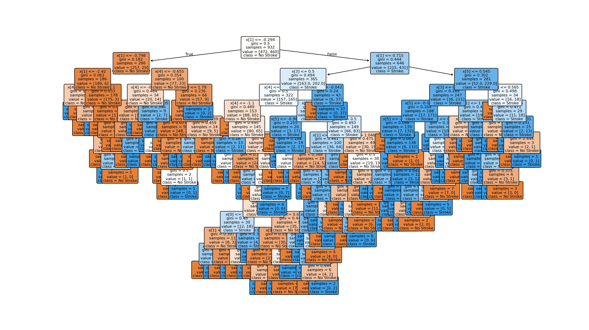

# Portafolio_Implementacion_TC3006C

Implementación manual de un algoritmo de aprendizaje automático sin el uso de frameworks o librerías de machine learning, implementación con framework y mejora con base en el diagnóstico.

## Descripción del dataset

El dataset elegido contiene información clínica y demográfica de pacientes con el propósito de clasificar si una persona puede sufrir un accidente cerebrovascular. 
El dataset se encuentra organizado de la siguiente manera:

| Variable             | Descripción |
|----------------------|-------------|
| `id`                 | Identificador único del paciente |
| `gender`             | Género (Male / Female / Other) |
| `age`                | Edad del paciente |
| `hypertension`       | Hipertensión (0 = No, 1 = Sí) |
| `heart_disease`      | Enfermedad cardíaca (0 = No, 1 = Sí) |
| `ever_married`       | Estado civil (Yes / No) |
| `work_type`          | Tipo de trabajo (Children / Govt_job / Never_worked / Private / Self-employed) |
| `Residence_type`     | Tipo de residencia (Rural / Urban) |
| `avg_glucose_level`  | Nivel promedio de glucosa en sangre |
| `bmi`                | Índice de masa corporal (IMC) |
| `smoking_status`     | Tabaquismo (Formerly smoked / Never smoked / Smokes / Unknown) |
| `stroke`             | Variable objetivo (1 = tuvo un stroke, 0 = no tuvo stroke) |

Fuente: [Kaggle - Heart Stroke Dataset](https://www.kaggle.com/datasets/madhavtesting/heart-stroke-dataset)

# Introducción
Elegí un problema relacionado con la salud, ya que es un tema que a la mayoría de las personas debería preocuparnos y ser nuestra prioridad, pero esto no muchas veces es así, por ende me gustaría realizar un modelo para pronosticar este tipo de accidentes. Obviamente, lo recomendado siempre será hacerse un análisis médico y acudir a especialistas de la salud. Tomando en cuenta la información como la que nos brinda el dataset podremos conocer que tan probable es que podamos llegar a sufrir un accidente cerebrovascular dependiendo de nuestras diferentes variables.

## Objetivo

Utilizaré un modelo de clasificación logística y árbol de decisión, donde mi "y" será stroke, lo que representa si tiene probabilidad de que sufra un accidente cerebrovascular y las "x" serán el resto de columnas de mi dataset, aunque no todas, puesto que más adelante por medio de ETL nos quedaremos con los datos más significativo. Una vez implementado tanto el modelo implementado desde 0 y el que usa un framework, se realizará una mejora, la cual busque mitigar un problema que tenga el modelo basado en el diagnóstico del mismo.

## Procedimiento

### ETL y Preprocesamiento de Datos

1. **Carga de datos:**  
   Se leyó el archivo CSV original que contenía la información y se creó el dataframe.

2. **Análisis inicial:**  
   Se exploraron valores nulos y se observó que la variable **bmi** tenía 135 valores faltantes, mientras que **smoking_status** contenía una categoría **Unknown** que representaba información ausente.

3. **Imputación de valores faltantes:**  
   - **bmi:**  
     En lugar de reemplazar los valores faltantes con una media o mediana global, se optó por imputar la **mediana agrupada por género y grupo de edad**.  
     - El índice de masa corporal (IMC) varía significativamente según el sexo y la etapa de la vida.  
     - Por ejemplo, el IMC promedio de un hombre de 15 años no es comparable con el de una mujer de 70 años.  
     - Esta técnica permite imputar valores más representativos y reduce el sesgo en los datos.  

   - **smoking_status:**  
     Se mantuvo la categoría **Unknown** como clase adicional.  
     - Eliminar estos registros significaría perder información valiosa y reducir el tamaño del dataset.  
     - Agruparlos dentro de una categoría evita descartar datos y permite que el modelo aprenda con la mayor información posible.
     - Sin embargo, esto puede introducir ruido, ya que saber si fuma o no, podría llegar a ser un factor de mucha relevancia.

4. **Transformación de variables categóricas:**  
   - **Variables binarias:**  
     - **gender**: se transformó como 1 = Male y 0 = Female.  
     - **ever_married**: se transformó como 1 = Yes y 0 = No.  
    - **Variables categóricas:**  
        Como el modelo implementado es muy básico, era indispensable trabajar únicamente con valores numéricos.  
        Por eso, las variables en formato de texto se transformaron en números:  
        - **gender y ever_married** se representaron como variables binarias (0 y 1).  
        - **work_type, Residence_type y smoking_status** se dividieron en varias columnas de 0 y 1, cada una indicando si el paciente pertenecía o no a esa categoría.  
        Esto permitió que el modelo pudiera procesar la información correctamente sin perder la esencia de cada variable. 

5. **Normalización de variables numéricas:**  
   - Las variables **age, avg_glucose_level y bmi** fueron transformadas usando la fórmula de normalización Z-score:  

     Z = (X - media) / desviación estándar  

   - Estas variables están en diferentes escalas (ej. edad en años, glucosa en mg/dL, IMC en kg/m²).
   - Normalizarlas garantiza que ninguna domine el cálculo del gradiente descendente por tener valores numéricamente más grandes.

6. **Análisis de la matriz de correlación**
   - Existe cierta multicolinealidad en datos relacionados con la edad que, al utilizar los dummies, llevan a ser redundantes y hasta obvios. Es en el caso de la edad, el trabajo y si alguna vez estuvo  casado, puesto que a los menores de edad no han trabajado ni se han casado, así que estas columnas pueden ser eliminadas porque pueden causar ruido al modelo. Por otro lado, los que tienen son sus propios empleadores y los que trabajan para empresas privadas tienen una correlación negativa, pero es lógico, ya que los que trabajan en sector privado no son sus propios empleadores y viceversa.

   

7. **Bias:**  
   Se agregó una columna de 1’s al inicio de la matriz de predictores para representar el sesgo (**bias**) de la regresión logística, permitiendo que la función hipótesis se ajuste de manera más flexible. Esto solo se necesita para el modelo logístico simple, ya que el árbol binario no necesita agregar un bias como en los modelos de regresión o redes neuronales.

8. **Partición de datos:**  
   El dataset fue dividido en:  
   - **60% entrenamiento**: para ajustar los pesos del modelo.  
   - **20% validación**: para ajustar hiperparámetros y monitorear el rendimiento durante el entrenamiento.  
   - **20% prueba**: para evaluar la capacidad de generalización del modelo en datos nunca vistos.

---

### Implementación del Modelo 

#### Modelo base
1. Se creó la clase **NeuronaLogistica** con las siguientes funciones:  
   - **Función hipótesis (sigmoide):** para mapear las entradas a probabilidades entre 0 y 1.  
   - **Función de costo (cross-entropy):** para medir el error del modelo en términos probabilísticos. Qué tan lejos están las predicciones de los valores reales. 
   - **Gradiente descendente:** actualización iterativa de los pesos para minimizar el costo.  
   - **Función de clasificación:** permite clasificar a cada paciente en dos grupos: con riesgo de stroke (1) o sin riesgo (0) según un umbral de 0.5.  

2. Se añadió una función para calcular la **exactitud (accuracy):**  
    - Esta métrica indica qué porcentaje de predicciones fueron correctas en comparación con los valores reales.  
   - Sin embargo, el **accuracy no siempre es una métrica completamente confiable**. Esto se debe a que mide solamente el porcentaje total de aciertos sin importar cómo se reparten entre las clases.  

   - En este proyecto, aunque se utilizó accuracy como métrica principal por simplicidad, lo ideal sería complementarlo con otras métricas como **precisión, recall y F1-score**, que dan una visión más completa del rendimiento del modelo.  

#### Árbol de decisión
1. Se implementó el clasificador **DecisionTreeClassifier**:
   - Profundidad máxima: limita el crecimiento del árbol para controlar la complejidad y evitar sobreajuste extremo.

   - Manejo de atributos: admite variables numéricas y categóricas ya transformadas a dummies durante el ETL; no requiere columna de bias.

   - Visualización del modelo: se graficó el árbol con plot_tree para inspeccionar reglas y nodos más relevantes.

2. Se calcularon las métricas de evaluación:
   - **Accuracy (Exactitud)**: Al igual que en el modelo base, el accuracy no siempre es una métrica suficiente

   - **F1-Score**: se agregó como métrica complementaria, ya que combina precisión y recall en un solo valor. Se utiliza especialmente en problemas con clases desbalanceadas, porque penaliza tanto los falsos positivos como los falsos negativos.

---

### Entrenamiento de los modelos
#### Modelo base:

1. Descenso de gradiente con **learning rate = 0.005** y **1000 épocas**.  
2. Se calcularon en cada época: 
   Costo (cross-entropy) para los conjuntos de entrenamiento, validación y prueba.
3. Se graficaron las curvas de evolución del costo y del accuracy, lo cual permitió analizar el modelo.

#### Árbol de decisión
1. Se utilizó la clase DecisionTreeClassifier de Scikit-learn con una profundidad de 19
2. El modelo se entrenó con el conjunto de entrenamiento y se evaluó en validación y prueba.
3. Se calcularon las métricas:
-  Accuracy: mide el porcentaje de predicciones correctas.
-  F1-Score: métrica más balanceada que combina precisión y recall, especialmente útil en este problema desbalanceado.
---

## Evaluación de Modelo de Regresión Logística

### Métricas obtenidas  
- Exactitud en entrenamiento: **74.46%**  
- Exactitud en validación: **75.16%**  
- Exactitud en prueba: **78.85%**  

### Evolución del costo

-  El costo (cross-entropy) disminuyó de manera estable a lo largo de las épocas, tanto en entrenamiento como en validación y prueba. Esto indica que el modelo fue ajustando sus parámetros correctamente y que el learning rate elegido de 0.005 permitió una convergencia progresiva sin oscilaciones ni divergencias. La curva también muestra que no hubo señales de sobreajuste, ya que los costos en validación y prueba son muy similares.

-  Se fijaron 1000 épocas como número de iteraciones, ya que a partir de ese punto el modelo alcanzaba su mayor nivel de exactitud y el costo dejaba de mejorar de forma significativa. Entrenar con más épocas no aportaba beneficios adicionales e incluso podía conducir a un empeoramiento por sobreajuste.

### Diagnóstico del modelo  
- **Bias:** Medio. El modelo logra aprender patrones básicos, pero al ser lineal tiene limitaciones para captar relaciones complejas en los datos clínicos.  
- **Varianza:** Baja. El desempeño en entrenamiento, validación y prueba es consistente, lo que indica buena capacidad de generalización.  
- **Nivel de ajuste:** El modelo presenta un **underfitting  moderado**, ya que no logra explotar toda la información disponible en el dataset, aunque tampoco cae en sobreajuste.  

## Evaluación del Modelo de Árbol de Decisión  

### Métricas obtenidas  
- Accuracy en entrenamiento: **100%**  
- Accuracy en validación: **96.12%**  
- Accuracy en prueba: **95.19%**  

- F1-Score en entrenamiento: **100%**
- F1-Score en validación: **95.68%**
- F1-Score en validación: **94.98%**

### Diagnóstico del modelo  
- **Bias:** Bajo. El árbol de decisión es lo suficientemente flexible para aprender relaciones complejas y llegar al 100% en entrenamiento, lo que significa que prácticamente no se equivoca en train (no hay underfitting).
- **Varianza:** Moderado. Existe una diferencia notable entre el 100% de entrenamiento y los valores en validación y prueba, lo cual refleja sobreajuste.
- **Nivel de ajuste:** El modelo muestra un ligero **overfitting**, ya que hay una brecha de train/val/test, pero el modelo generaliza hasta cierto punto bien, siguiendo con un buen rendimiento.

### Ajuste de parámetros

- La elección de una profundidad máxima de 15 se debe a que en ese punto el árbol alcanza un 100% de exactitud en entrenamiento y valores cercanos al máximo posible en validación y prueba. Al aumentar la profundidad más allá de este valor, el modelo continúa memorizando los datos de entrenamiento, pero no logra mejoras en el rendimiento sobre datos nuevos. Por tanto, la profundidad en 15 representa el nivel donde el árbol ya explotó toda su capacidad predictiva sin obtener beneficios adicionales de un crecimiento mayor.

---

## Comparación entre Modelos  

| Aspecto                  | Regresión Logística                           | Árbol de Decisión                         |
|---------------------------|-----------------------------------------------|-------------------------------------------|
| **Accuracy (Test)**      | 78.85%                                        | 95.19%                                    |
| **Bias**                  | Medio: capta patrones básicos pero limitado por su naturaleza lineal. | Bajo: aprende relaciones complejas y se ajusta casi perfectamente al train. |
| **Varianza**              | Baja: resultados consistentes en train, val y test. | Moderada: 100% en train vs. ligera caída en val/test. |
| **Nivel de ajuste**       | Underfitting moderado.                          | Ligero overfitting.                       |
| **Ventajas**              | Estable y con bajo riesgo de sobreajuste. | Alta precisión y capacidad para capturar relaciones no lineales. |
| **Desventajas**           | No modela interacciones complejas.            | Tiende a sobreajustar si no se controla la profundidad. |

---

## Limitaciones  

- **Regresión logística:** solo aprende relaciones lineales, por lo que ignora posibles interacciones complejas entre variables.  
- **Árbol de decisión:** tiende a sobreajustar, especialmente si no se controla su profundidad.
- **Dataset:** La variable objetivo está desbalanceada(menos casos de stroke que de no-stroke). Esto impacta en la interpretación del accuracy, ya que un modelo puede obtener altos valores de exactitud sin necesariamente detectar bien los casos positivos.

---
## Modelo con mejoras

- Para mejorar el desempeño del árbol de decisión y reducir el sobreajuste observado en el modelo base, se aplicó la técnica de poda de complejidad. 
- **Técnica de regularización usada:** La poda consiste en simplificar el árbol eliminando ramas que aportan poca ganancia en la clasificación, penalizando la complejidad del modelo. Esto permite encontrar un mejor balance entre ajuste a los datos de entrenamiento y capacidad de generalización en validación y prueba.

### Métricas obtenidas  
- Accuracy en entrenamiento: **98.61%**  
- Accuracy en validación: **92.90%**  
- Accuracy en prueba: **92.94**  

- F1-Score en entrenamiento: **98.59%**
- F1-Score en validación: **92.19%**
- F1-Score en validación: **92.66%**

### Diagnóstico del modelo  
- **Bias:** Ligero incremento. El modelo ya no memoriza todos los datos de entrenamiento como antes, con 100%, lo cual implica que acepta un poco más de error en entrenamiento.
- **Varianza:** Disminuyó respecto al modelo inicial. La diferencia entre train y validación/test es ahora menor, siendo muy similares las 2 ultimas. Esto significa que el árbol generaliza mejor y depende menos de los datos de entrenamiento.
- **Nivel de ajuste:** El modelo dejó de estar en overfitting extremo y alcanzó un mejor equilibrio. Aunque perdió un poco de rendimiento en validación/prueba de ~95% a ~93%, este sacrificio es positivo porque ahora el modelo es más robusto y estable.

---

## Conclusión

La implementación permitió comparar dos enfoques distintos de clasificación, regresión logística y árboles de decisión, además de aplicar una mejora basada en técnicas de regularización.

El modelo de regresión logística mostró un desempeño moderado de ~79% en prueba, siendo estable y con baja varianza, pero limitado por su naturaleza lineal, lo que impidió capturar interacciones complejas entre variables clínicas.

Por su parte, el árbol de decisión alcanzó un rendimiento inicial muy alto ≈95% en prueba, aunque con claros indicios de sobreajuste, ya que en entrenamiento llegó al 100%. La aplicación de poda de complejidad permitió controlar dicho sobreajuste, reduciendo ligeramente la exactitud ≈93% en prueba pero logrando un modelo más equilibrado y generalizable.

En problemas clínicos, no basta con obtener la mayor exactitud en train, la capacidad de generalización es clave para un modelo confiable. 